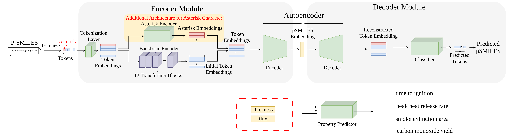

# poly4mer `v2.0.0`
A multi-physics synthesis based chemical language model for polymer fire property prediction and inverse design, with conditioning on environmental parameters (heat flux and sample thickness).



*Architecture overview: tokenized pSMILES (with `*` asterisk monomer markers) pass through the SMI-TED backbone encoder and a dedicated asterisk encoder, are projected to a 768-dim latent via the autoencoder, and are concatenated with the test-condition vector (thickness, flux) before being fed to four property predictors (Tig, pHRR, SEA, CO). The decoder + classifier reconstruct the pSMILES from the latent for inverse design. Source figure: [`poly4mer_v2.pdf`](poly4mer_v2.pdf).*

This repository houses the code for our work in forward prediction and inverse polymer design using chemical language models.

**Highlights**:

1. The model is developed based on [SMI-TED](https://github.com/IBM/materials/tree/main), and trained to predict 4 flammability metrics: time to ignition (Tig), peak heat release rate (pHRR), smoke extinction area (SEA), and carbon monoxide yield (CO) from polymer SMILES.

2. We introduce a principled multi-physics synthesis framework to data-scarce learning by embedding domain knowledge directly into language model training, enabling robust generalization beyond pure data-driven chemical language models.

3. We design a new strategy for introducing new tokens into pretrained language models via encoder-decoder architecture expansion, leveraging monomer representations to capture complex polymer semantics.

4. We architect an autoencoding system coupling predictive modeling with generative design, enabling inverse polymer design via latent-space exploration and structure reconstruction for targeted applications.

5. Predictions and inverse design are conditioned on the heat flux and sample thickness of the test setup, so the same polymer can be evaluated under multiple fire-test scenarios.

## Requirements
A ready-to-use Conda environment file (`poly4mer.yml`) and a Python package requirements file (`requirements.txt`) are provided.

To set up the environment:

```bash
conda env create -f poly4mer.yml
conda activate poly4mer
pip install -r requirements.txt
```

Key dependencies include:
- Python 3.10.18
- numpy==2.2.6
- torch==2.10.0
- transformers
- tokenizers==0.21.2
- rdkit==2025.3.3
- pandas==2.3.3

## Pretrained models
The SMI-TED Python package is bundled with this repository under `smi_ted_light/`; you only need to download the model weights.

Download the following from our HuggingFace mirror and place them at the paths shown:

- [Fire property predictors (4 files)](https://huggingface.co/fishmoon1234/poly4mer) → `checkpoint/predictor_model/`
  - `tig_model_params821761_mean.ckpt`
  - `pkhrr_model_params821761_mean.ckpt`
  - `Ysmk_model_params821761_mean.ckpt`
  - `Yco_model_params820737_mean.ckpt`
- [Decoder + asterisk encoder + autoencoder bundle](https://huggingface.co/fishmoon1234/poly4mer) → `checkpoint/decoder_predictor_autoencoder/`
  - `model_params974699520_lamb1_best_val_current.ckpt`
- [Pretrained SMI-TED encoder](https://huggingface.co/fishmoon1234/poly4mer) → `smi_ted_light/`
  - `smi-ted-Light_40.pt`

The input/output normalization stats (`checkpoint/optimal_model/scalers.pt`) ship with the repository.

After downloading, the layout should look like:

```
poly4mer/
|-- smi_ted_light/
    |-- bert_vocab_curated.txt
    |-- fast_transformers/
    |-- load.py
    |-- smi-ted-Light_40.pt
    ...
|-- checkpoint/
    |-- optimal_model/
        |-- scalers.pt
    |-- predictor_model/
        |-- tig_model_params821761_mean.ckpt
        |-- pkhrr_model_params821761_mean.ckpt
        |-- Ysmk_model_params821761_mean.ckpt
        |-- Yco_model_params820737_mean.ckpt
    |-- decoder_predictor_autoencoder/
        |-- model_params974699520_lamb1_best_val_current.ckpt
|-- bert_vocab_curated.txt
|-- fire_optimize_smiles_v2.py
|-- fire_property_predict_v2.py
|-- Canonicalize_for_Optimize.py
|-- args_nl.py
|-- utils.py
|-- models.py
|-- example_smiles.txt
|-- run_property_prediction.sh
|-- run_design.sh
...
```

## Running experiments

**Property predictor**:

1. Add the pSMILES of polymers to be predicted in
```
example_smiles.txt
```

2. Edit the corresponding polymer index and the test conditions in
```
run_property_prediction.sh
```
The test conditions are the heat flux (`flux`) and the sample thickness (`thickness`); both are passed to the model so the same polymer can be queried under different fire-test scenarios.

3. Run predictor with the shell script
```
./run_property_prediction.sh
```

**Polymer design**:

1. Add the pSMILES of candidate initialization polymers in
```
example_smiles.txt
```

2. Edit the corresponding polymer index in
```
run_design.sh
```
together with the penalty parameters, the test conditions, and the optimization hyperparameters.

The test conditions are the heat flux and the sample thickness:
```
flux=75
thickness=6
```

For the penalty parameters, one can tune
```
c_tig=0.1
c_qpua=1
c_sea=1
c_co=1
```
to change weights between different fire properties.

For the optimization hyperparameters, one can change the maximum optimization steps and the step size.

3. Run inverse design with the shell script
```
./run_design.sh
```

4. Candidate polymers are stored in
```
results/optimized_smiles_canonicalized/tig${c_tig}_phrr${c_qpua}_sea${c_sea}_co${c_co}_flux${flux}_thickness${thickness}/optimized_smiles_canonicalized_${idx}_lr_${lr}.txt
```
The optimization path and estimated fire property values can be found in
```
results/log_optimized_prop/tig${c_tig}_phrr${c_qpua}_sea${c_sea}_co${c_co}_flux${flux}_thickness${thickness}/log_optimized_props_${idx}_lr_${lr}.txt
```

## Citation

If you find our models useful, please consider citing our papers:

```
@article{liu2025harnessing,
  title={Harnessing large language models for data-scarce learning of polymer properties},
  author={Liu, Ning and Jafarzadeh, Siavash and Lattimer, Brian Y and Ni, Shuna and Lua, Jim and Yu, Yue},
  journal={Nature Computational Science},
  volume={5},
  number={3},
  pages={245--254},
  year={2025},
  publisher={Nature Publishing Group US New York}
}
@inproceedings{yin2025fake,
  title={Fake It Till You Make It: Multi-Physics Synthesis Breaks the Data Barrier in Chemical Language Models},
  author={Yin, Naiyu and Liu, Ning and Chen, Jiuzhou and Lattimer, Brian Y and Lua, Jim and Yu, Yue},
  booktitle={NeurIPS 2025 Machine Learning and the Physical Sciences Workshop}
}
```
